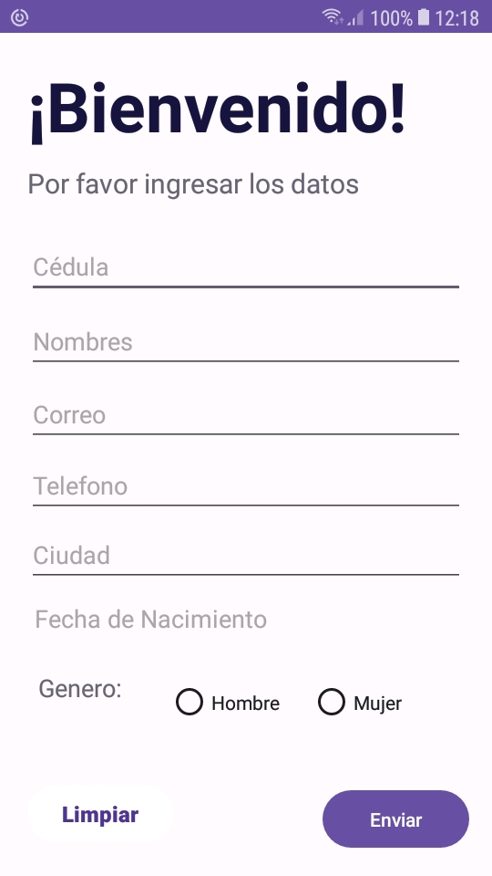
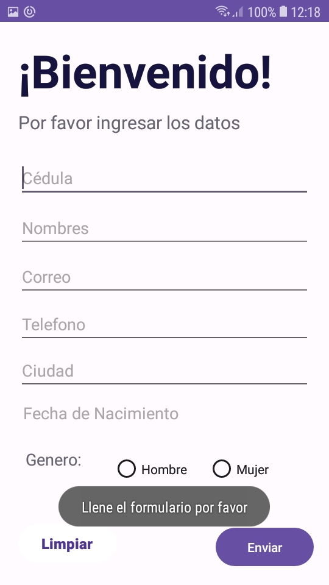
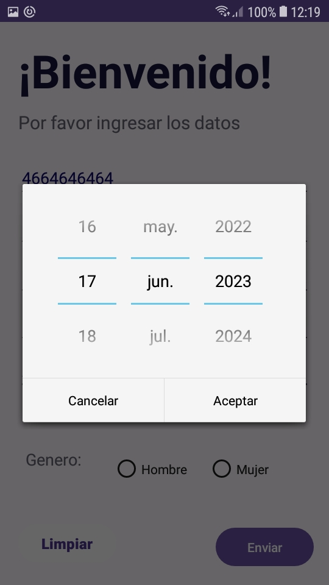
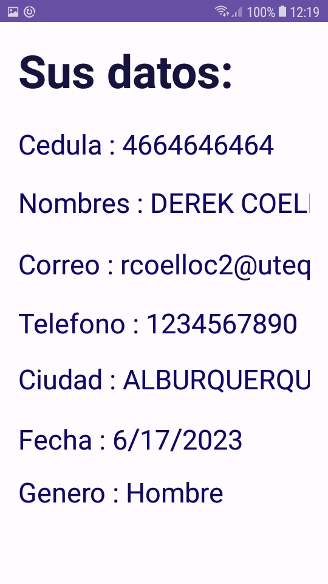

# DESARROLLAR UNA APLICACIÓN MÓVIL ANDROID CON EL USO DE LOS CONTROLES COMUNES DE LA INTERFAZ DE USUARIO (UI) DE ANDROID
-Formulario con los controles:

-Cuando se intenta enviar los datos sin llenar todos los controles del formulario:

-De esta manera se agrega la fecha de nacimiento:

-Formulario con los datos ingresados:

-Los datos ingresados se ven en la siguiente actividad de android:

# Gracias por ver

